# Memory-Efficient Training of Large Language Models Using Liger Kernel and Other Techniques in 2024

- **Midterm Report** for the course *Artificial Intelligence* (2024 Fall)
- **Submitted on:** 2024/10/23  
- **Author:** Yong-Cheng Liaw (312581029 廖永誠), Master's Student at National Yang Ming Chiao Tung University  
- **Group:** 10


# Title and Authors

- **Title:** Liger Kernel: Efficient Triton Kernels for LLM Training
- **Authors:** Pin-Lun Hsu, Yun Dai, Vignesh Kothapalli (LinkedIn Inc.)
- **Publication:** Technical Report published as a preprint on Arxiv (2024/10/14)
- **Code:** 3.3K Stars, Open-source Project on GitHub (2024/08/07)


# Background and Motivation

## Recent LLM Model Architecture

In recent Large Language Model Architecture, the model architecture has undergone some changes compared to the original transformer architecture. The original transformer architecture is a stack of encoder and decoder, with self-attention and cross-attention [1]. However, after the OpenAI GPT series, the state-of-the-art architecture became a decoder-only model [2,3,4]. Nowadays, the state-of-the-art open-source model, Llama 3.2, also utilizes a dense decoder-only architecture, similar to GPT-2. However, they have some small differences compared to GPT-2.

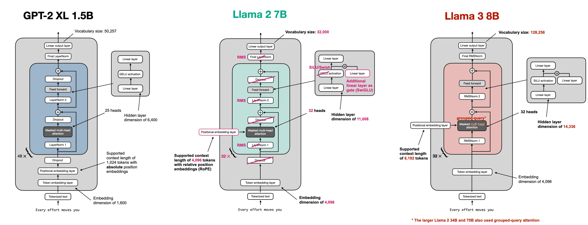
- **Figure1: From GPT Architecture to Llama3 Architecture [5].**

The key differences are:
1. Convert absolute positional embedding into RoPE (Rotary Positional Embedding) [6].
2. Convert Layer Normalization into RMS Norm [7].
3. Convert GELU into SwiGLU [8].
4. Remove Dropout.
5. Convert multi-head attention into Group Query Attention (GQA) [9].

## The GPU VRAM Usage During Training

### Static Memory

When training Large Language Models (LLMs), a significant portion of GPU memory is consumed by static memory usage, which primarily consists of three main components: model weights, gradients, and optimizer states. Understanding these components is crucial for efficient memory management during the training process [10].

#### Model Weights

Model weights represent the parameters of the neural network and are a fundamental component of any LLM. The memory required for storing model weights is directly proportional to the number of parameters in the model. For instance, a GPT-2 model with 1.5 billion parameters requires approximately 3GB of memory for its weights when using 16-bit precision (2 bytes per parameter).

#### Gradients

Gradients are essential for updating the model weights during the training process. They typically require the same amount of memory as the model weights themselves. For a 1.5 billion parameter model, this would translate to about 3GB of memory for gradients.

#### Optimizer States

Optimizer states often consume the largest portion of static memory during training. The memory requirements for optimizer states like momentum, variance, master weights in popular optimizers like Adam can be significant. For instance, using mixed-precision training with Adam [11] or AdamW [12] can require up to 12 bytes per parameter just for optimizer states. Because it requires storing two additional tensors for each parameter: the momentum and variance of the gradients. When using mixed-precision training with Adam, the memory consumption includes:
1. An fp32 copy of the parameters (4 bytes per parameter)
2. Momentum (4 bytes per parameter)
3. Variance (4 bytes per parameter)

This results in a total of 12 bytes per parameter just for optimizer states.

#### Total Static Memory Usage

For a model with P parameters trained using mixed-precision Adam/AdamW, the total static memory usage can be approximated as:

```
Static Memory = (2P + 2P + 12P) bytes
               = 16P bytes
```

Where:
- 2P bytes for fp16 model weights
- 2P bytes for fp16 gradients
- 12P bytes for optimizer states (fp32 weights copy, momentum, and variance)

For example, a 1.5 billion parameter model would require at least 24GB of static memory during training.

#### Static Memory Optimization Techniques

To reduce static memory usage, several techniques can be employed:

1. **ZeRO**: This technique distributes optimizer states across multiple GPUs, reducing the memory required on each device. The popular implementation of ZeRO [13] is available in DeepSpeed [14] or PyTorch FSDP [15].

2. **DeepSpeed Offloading**: DeepSpeed allows offloading optimizer states to CPU memory or even SSD memory, freeing up GPU memory for model weights, gradients, and optimizer states [16,17].
    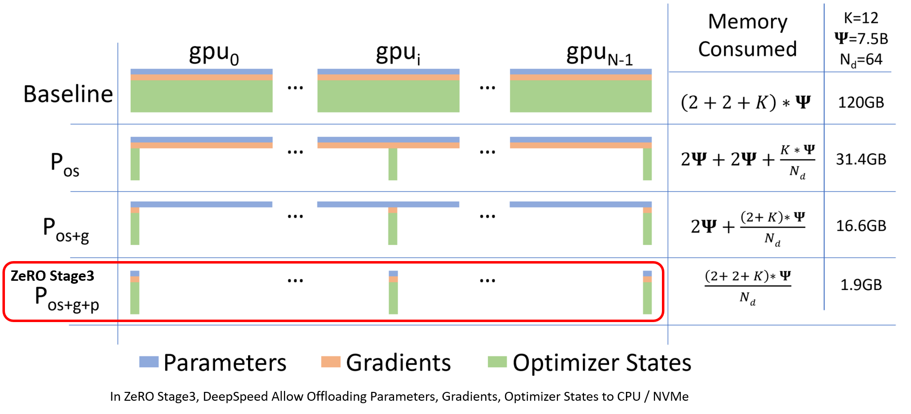
    - Figure 2: ZeRO Memory Consumption [17]

3. **Mixed Precision Training**: Using lower precision (e.g., bfloat16, float16) for weights and gradients can significantly reduce memory consumption and improve training speed if supported by the hardware [18].

4. **8-bit Optimizers**: This focuses on quantizing optimizer states, such as momentum and variance, into 8-bit by utilizing block-wise quantization to prevent precision degradation [19].

5. **Gradient Low-Rank Projection (GaLore)**: This approach can reduce optimizer state memory usage by up to 65.5% while maintaining performance by utilizing Low-Rank Projection for optimizer states [20].

6. **LoRA and QLoRA**: LoRA is a technique that reduces static memory usage by decreasing the number of trainable weights. It projects the same weight matrix using two low-rank matrices, which reduces memory, gradients, and optimizer states. Since the frozen part of the model still requires complete model weights, QLoRA works by further quantizing that part to reduce the memory consumption of model weights [21,22].


### Activation Memory

Activation memory refers to the memory used to store intermediate tensors (activations) generated during the forward pass of a neural network. These activations are essential for the backward pass, where gradients are computed for updating model parameters. Activation memory is dynamic and varies with the batch size, model architecture, and sequence length. It tends to dominate GPU memory usage during training because activations need to be stored until they are used in backpropagation.

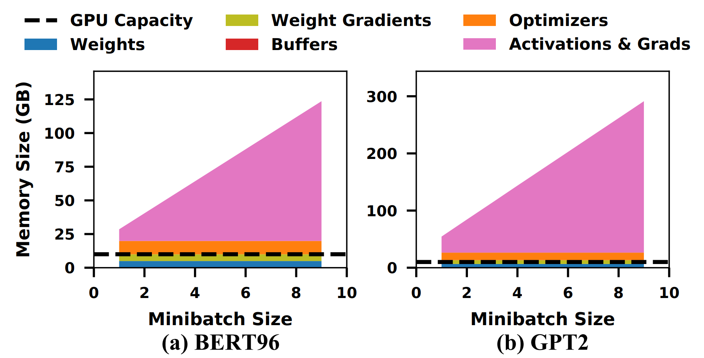
- **Figure 3: Memory footprint statistics for training massive models [10].**

#### Gradient Checkpointing (Activation Checkpointing)

Gradient checkpointing is a technique that trades compute for memory by recomputing intermediate activations during the backward pass instead of storing them in memory. This can significantly reduce the memory footprint during training, especially for models with large memory requirements. However, gradient checkpointing can introduce additional computation overhead due to recomputing activations, which may impact training speed [23].


- **Figure 4: Example of Gradient Checkpointing [23].**

### GPU VRAM Bottleneck

So after we have optimized the static memory like using DeepSpeed CPU Offloading to move all static memory from GPU to CPU, enable Gradient Checkpointing to discard all activation. The peak GPU memory usage caused by following two parts:
1. **Stored Checkpoint:** the actual checkpointed value, in the Huggingface Transformers library, a checkpoint is added to the input of each decoder layer. Therefore, the checkpointing value only needs to store the following: `batch * seq * hidden_size * dtype_size * num_layers`. For example, using **LLaMA 3.2 1B** with `batch = 4`, `seq = 1024`, `hidden_size = 2048`, `dtype_size = 2` (fp16), and `num_layers = 16`, the checkpointing value is calculated as: `4 * 1024 * 2048 * 2 * 16 = 268,435,456 bytes = 256MB`.
2. **Temporary activation:** occurring between two checkpoints or in sections that aren't checkpointed, the largest factor comes from **cross-entropy-related activations**, which include logits, shifted logits, and intermediate values during the cross-entropy calculation.

    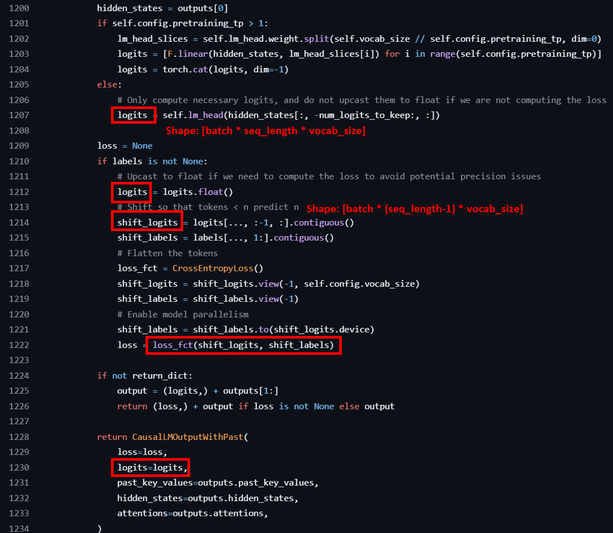
    - **Figure 5: Llama3.2 Logits related Implementation of HuggingFace Transformers Library.**

The logits is significant because the `vocab_size` is often much larger than the `hidden_size`. For example, in LLaMA 3.2 1B, `vocab_size = 128,256`, while `hidden_size = 2048`. Thus, a single logits value can occupy:
`4 * 1024 * 128,256 * 4 (cast to float for loss calculation) = 2,101,346,304 bytes ≈ 2GB`.
Moreover, there are multiple instances of these logits-related values. In our experiments, we observed that there are three logits-related values active simultaneously (logits, shift_logits, cross-entropy temp value). This results in: `2GB * 3 = 6GB` VRAM usage.
    
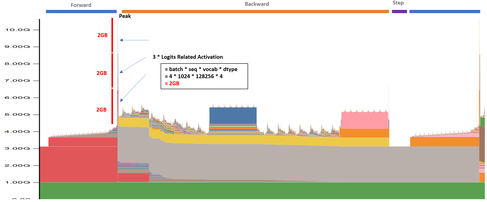
    
- **Figure 6: VRAM Snapshot for training Llama3.2 1B while enable gradient checkpoint + zero infinity cpu offloading with batch=4, seq=1024.**

The factor affecting logits memory usage is primarily `batch_size` and `seq_size`. Therefore, increasing the batch size or sequence length leads to a rapid increase in peak memory usage.
    
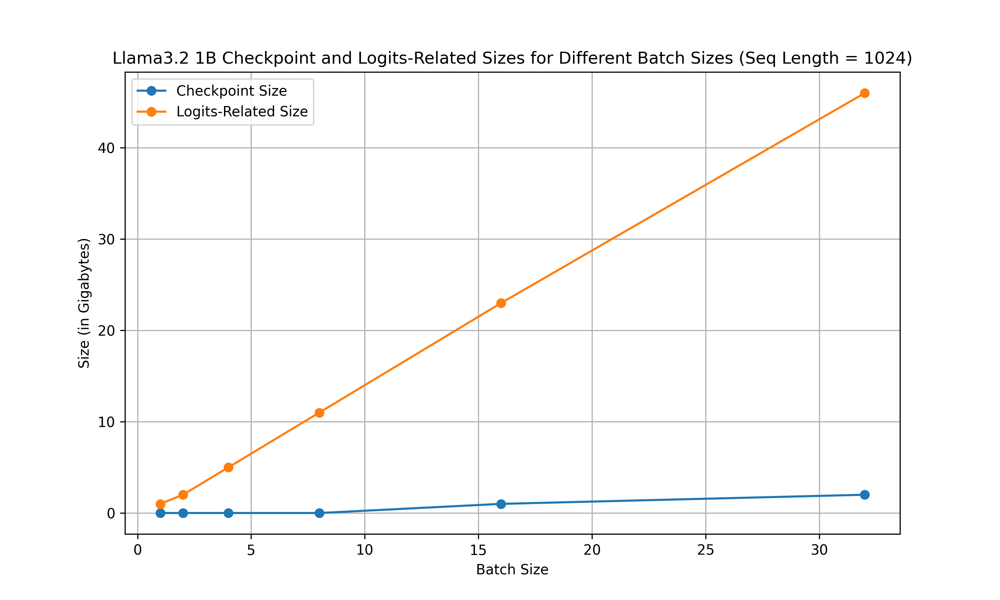
- **Figure 7: Comparison of Estimated Scaling Memory Usage between Checkpoint and Logits-Related Size.**

This peak memory usage limits the batch size that can be increased, even if there is space available to use.

## Kernel Operation Level Optimization

In current PyTorch, we can easily develop models by executing calculations in the eager execution model. However, this is not the best way to fully utilize GPU power because there are many computational overheads, including function call stack, dispatching, and CUDA kernel launch latencies [24,25,26].

### Dispatching Overhead

PyTorch uses a dynamic dispatching mechanism to determine which implementation of an operation to use based on input types and devices. This process introduces overhead in several ways:
1. **Type checking:** The system must check the types of input tensors for each operation.
2. **Device selection:** The appropriate implementation (CPU, CUDA, etc.) must be selected for each operation.
3. **Operator lookup:** The correct operator implementation must be found and called for each operation.

### CUDA Kernel Launch Latencies

When using GPUs, eager mode can lead to significant overhead due to CUDA kernel launch latencies:
1. **Frequent kernel launches:** Each operation typically results in a separate CUDA kernel launch.
2. **Launch overhead:** There's a fixed overhead associated with each kernel launch, which can be significant for small operations.

### Memory Transfer Overhead

Eager mode can result in suboptimal memory usage patterns:
1. **Frequent host-to-device transfers:** Input data may need to be transferred from CPU to GPU memory more frequently than necessary.
2. **Intermediate results:** Each operation may write its results back to memory, increasing memory bandwidth usage.

### Kernel Fusion

Due to the above overheads, kernel fusion is a technique that combines multiple operations into a single kernel to reduce overhead and improve performance. By fusing operations together and optimizing the kernel implementation, we can reduce the number of kernel launches, memory transfers, and dispatching overheads.  
A popular approach to perform kernel fusion is writing GPU kernel operations in Triton [27].

Triton is a language and compiler for parallel programming. It aims to provide a Python-based programming environment for productively writing custom DNN compute kernels capable of running at maximal throughput on modern GPU hardware.

```python
BLOCK = 512
@jit
def add(X, Y, Z, N):
   # In Triton, each kernel instance
   # executes block operations on a
   # single thread: there is no construct
   # analogous to threadIdx
   pid = program_id(0)
   # block of indices
   idx = pid * BLOCK + arange(BLOCK)
   mask = idx < N
   # Triton uses pointer arithmetic  
   # rather than indexing operators
   x = load(X + idx, mask=mask)
   y = load(Y + idx, mask=mask)
   store(Z + idx, x + y, mask=mask)
```

The Liger Kernel uses Triton to implement fused operations at the kernel level. The reasons for using Triton are as follows:
1. **Easier programming:** Compared to writing the kernel in C++ CUDA, Triton allows writing kernels in Python, making development and debugging easier.
2. **Kernel Level Optimization:** Compared to the eager execution model, Triton can optimize at the kernel operation level, enabling more detailed optimizations.
3. **Python-native:** There's no need to maintain different types of code files, like C++ and Python.
4. **Clean dependency:** Triton is a standalone library that can be easily integrated into existing codebases.
5. **Real Production Ready Usecase:** There are already several successful kernel operation-level projects done using Triton, such as Unsloth [29].

        
# Method

## Fused Linear Cross Entropy

In the previous section, we discussed the memory bottleneck caused by cross-entropy-related activations during training. The Fused Linear Cross Entropy aims to solve this problem through a two-way approach:
1. **Split the cross-entropy calculation into chunks to reduce peak memory usage.**

    The reason we can separate the cross-entropy calculation into chunks is that to calculate the **cross-entropy loss** in a Causal Language Model (LM) for an input with shape `[batch_size, seq_length]`, it is compare the predicted token probabilities with the ground truth token indices for the next token at each position in the sequence, but the final loss is the average of the losses at each position. Therefore, the cross-entropy loss can be calculated independently for each position in the sequence. The formula for the cross-entropy loss is: 
    
    .

    Where:
    - *N* is the batch size
    - *T* is the sequence length
    - *y_t* is the ground truth token at time step *t+1*
    - *p(y_t | x_{1:t})* is the predicted probability of token *y_t* given the tokens *x_{1:t}*

2. **Calculate the backward gradient when calculating the forward pass, utilizing in-place calculation to reduce memory usage.**

    The reason we can calculate the backward gradient during the forward pass is that the cross-entropy loss is the last operation in the forward pass, so it doesn't rely on other back-propagated gradients. Additionally, because the cross-entropy loss can be calculated independently for each position in the sequence, the gradients can also be calculated independently for each position. Therefore, we can calculate the gradients in-place during the forward pass, reducing memory usage by not storing the intermediate activations.

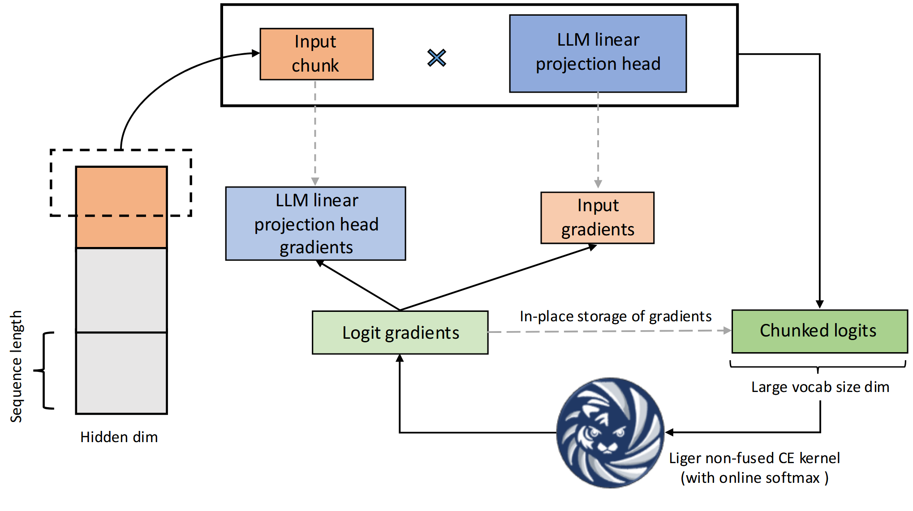
- **Figure 8: Fused Linear Cross Entropy**

The advantages of the Fused Linear Cross Entropy are that by chunking the cross-entropy calculation, the peak memory usage is not calculated by `batch_size * seq_size * vocab_size`, but by `chunk_size * vocab_size`, which can limit the peak memory usage, even if the batch size or sequence length is increased. By calculating the backward gradient during the forward pass, it can further reduce memory usage by not storing intermediate activations. Last but not least, the fused operation can reduce overhead by reducing the number of kernel launches, memory transfers, and dispatching overheads.

However, there are some disadvantages to the Fused Linear Cross Entropy. If the chunk size is too small, the calculation will be done chunk by chunk, which will decrease GPU utilization. Therefore, setting the correct chunk size is crucial for the performance of the Fused Linear Cross Entropy. In their current work, they try to set the chunk size so that the temporary activation memory is the same as the hidden_size activation, which can keep peak memory usage stable. The chunk size is calculated by .

This formula can be explained as follows: since hidden activation is *BT * H*, and chunk activation is *chunk_size * V*, so *chunk_size =* . And because the chunk size should be a power of 2, the ceiling function is applied, followed by calculating the log2 and raising 2 to that power.


## Other Fused Kernels

Following the same principle as the Fused Linear Cross Entropy, the Liger Kernel also provides other fused kernels to optimize the training process. These fused kernels include:
1. **RMSNorm (Root Mean Square Normalization) [7]**
2. **RoPE (Rotary Positional Embedding) [6]**
3. **SwiGLU [8]**
4. **GeGLU [8]**
5. **Layer Normalization [30]**

These fused kernels aim to fuse small operations together rather than executing them one by one. For example, in the case of RMSNorm, the formula is: 


The calculation includes both the normalization and scaling parts, which can be fused together. Additionally, because it is a fused operation, some calculations can be done in place to reduce memory usage, and values like the RMS can be cached to reduce computation overhead.

# Experimental Results

The Liger Kernel runs all benchmarks on a single NVIDIA A100 GPU (80 GB). The CrossEntropy kernel is benchmarked on vocab sizes in the set {40960, 81920, 122880, 163840}. The GeGLU and SwiGLU kernels are benchmarked on varying sequence lengths, whereas the RMSNorm, LayerNorm, and RoPE kernels are benchmarked on varying hidden dimensions. The sequence lengths and hidden dimension sizes are chosen from {4096, 8192, 12288, 16384}. All benchmarks are repeated 10 times to plot the median speed and memory along with [0.2, 0.8] quantile values as the lower and upper bounds.

1. **Speed Benchmark:**

    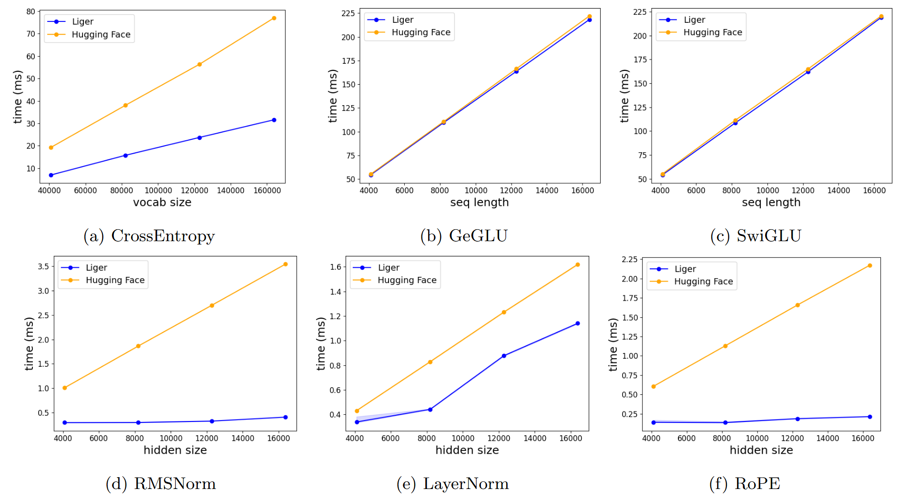
    - **Figure 9: Kernel execution speed benchmarks**

2. **Peak Memory:**

    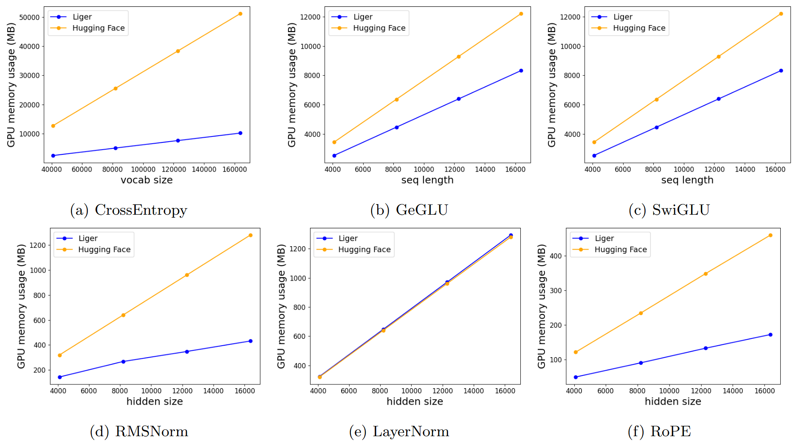
    - **Figure 10: Kernel peak allocated memory benchmarks.**

3. **Llama3 8B Training with Fixed seq_length 512:**

    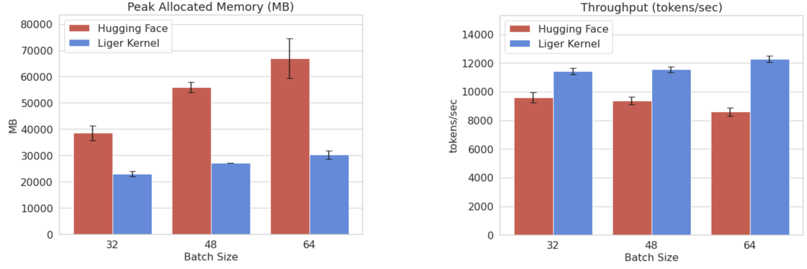
    - **Figure 11: Comparison of peak allocated memory and throughput for LLaMA 3-8B.**

The result is promising, showing that the Liger Kernel can significantly reduce memory usage and improve training speed compared to the baseline. In the real training process, the Liger Kernel only slightly increases the peak memory usage when scaling up the batch size, whereas the original Hugging Face implementation increases the peak memory usage linearly. This allows researchers or anyone who wants to train a large language model to scale up the batch size without worrying about peak memory usage. The Liger Kernel can also improve the overall throughput of the training process, which can reduce the training time and cost.


# DEMO

To reproduce the results and profile the actual memory usage reduction and throughput improvement by the Liger Kernel, I designed the following experiments to demonstrate the Liger Kernel's impact on training LLMs. All demo code is available on the following GitHub Repository [113-1-Artificial-Intelligence-Midterm](https://github.com/DandinPower/112-2-Artificial-Intelligence-Midterm).

- **Experiment Environment:**
    - Operating System: Ubuntu 24.04 Desktop
    - CPU: i9-13900K
    - DRAM: 128GB
    - GPU: NVIDIA 4090 24GB

- **Experiment Setup:**
    - Batch Size (fixed sequence length at 1024): 1, 4, 8, 16, 32, 64, 96, 112
    - Sequence Length (fixed batch size at 4): 512, 1024, 2048, 4096, 8192, 12288, 16384, 24576
    - Model: Llama3.2 1B (Huggingface Transformers)
    - Full Parameter Training: No LoRA
    - Enable mixed precision training (fp16)
    - Enable Gradient Checkpointing
    - Enable DeepSpeed CPU Weights and Optimizer States Offloading

This setup moves all static memory from the GPU to the CPU and discards all activation memory, so the peak memory usage is mainly caused by checkpointing values, temporary activations, and the gradients for the optimizer step. This allows us to easily observe the impact of the Liger Kernel.

- **Memory Usage Profiling:**

    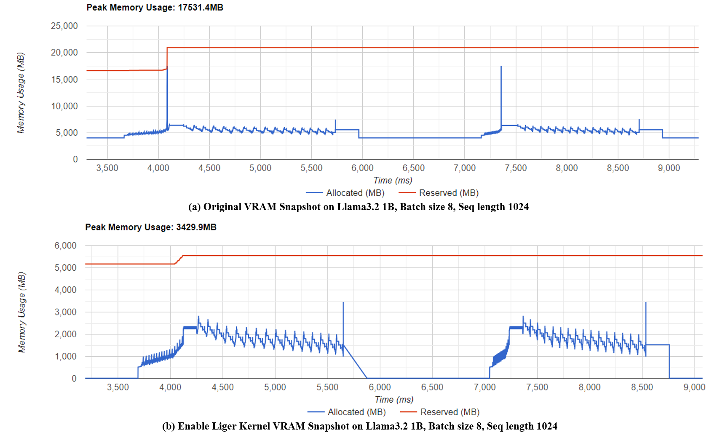
    - **Figure 12: VRAM Snapshot of Llama3.2 1B, Batch Size 8, Seq Length 1024 with (a) HuggingFace Transformers (b) Liger Kernel enabled.**

    The memory snapshot is generated using the PyTorch profiler and Tensorboard [33]. From the result, we can observe that after enabling Fused Linear Cross Entropy, the peak memory issue no longer exists.

- **Comparison of Throughput and Peak Memory Usage with a Fixed Sequence Length:**

    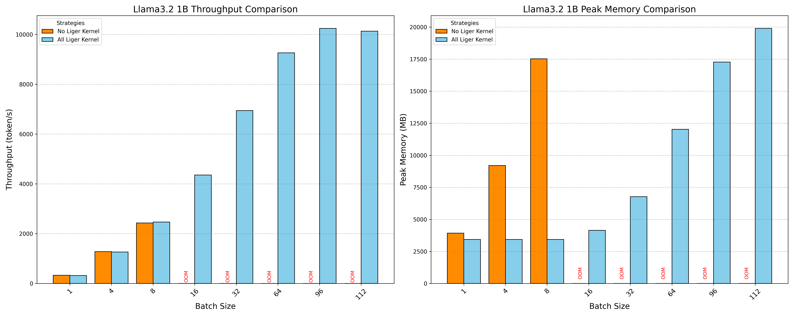
    - **Figure 13: Comparison of Throughput and Peak Memory Usage between Liger Kernel and Huggingface Transformers with a Fixed Sequence Length.**

- **Comparison of Throughput and Peak Memory Usage with a Fixed Batch Size:**

    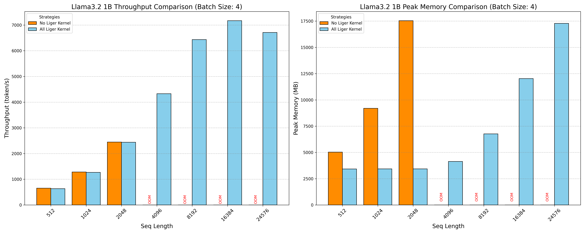
    - **Figure 14: Comparison of Throughput and Peak Memory Usage between Liger Kernel and Huggingface Transformers with a Fixed Batch Size.**

    From the peak memory usage results, we can see that without using the Liger Kernel, due to Cross-Entropy-related activations, the peak memory usage increases linearly with the batch size or sequence length. However, when using the Liger Kernel, the peak memory usage scales much more slowly. HuggingFace encountered an OOM issue at batch size `16`, or sequence length `2048`, but the Liger Kernel can scale up to batch size `112` or sequence length `24576` without any issue. Throughput is also improved by using the Liger Kernel for two reasons: one, the kernel execution speed is faster, and two, we can run at a larger batch size, which utilizes the GPU more efficiently.

- **Memory Usage Increase After Enabling Liger Kernel:**

    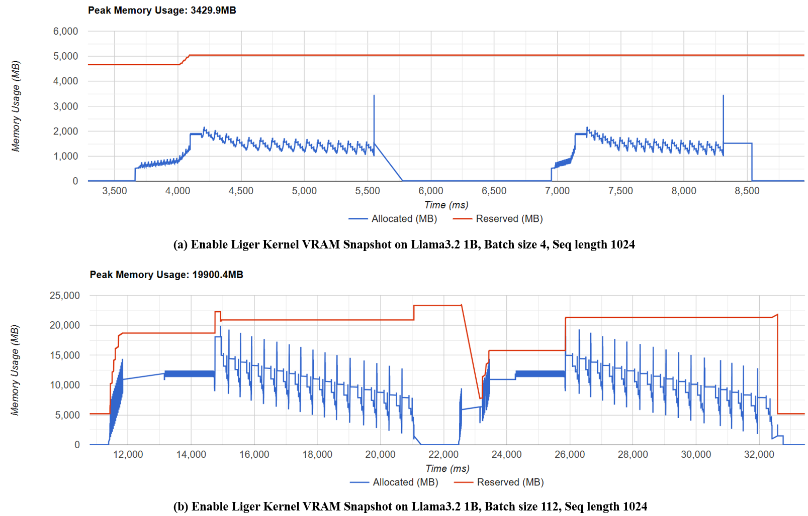
    - **Figure 15: VRAM Snapshot of Llama3.2 1B, Seq Length 1024 with (a) Batch Size = 4 (b) Batch Size = 112.**

    By comparing the memory usage patterns at Batch Size 4 and Batch Size 112, we can see that, since the cross-entropy peak issue is resolved, the memory usage pattern increases more reasonably. The memory increase is caused only by other temporary activations, which are calculated by a factor like `batch_size * seq_size * hidden_size`. Compared to the original `batch_size * seq_size * vocab_size`, the memory usage is much more reasonable, and the GPU utilization is much higher because we can use a larger batch size to fully utilize the GPU.


## Ablation Study on Fused Linear Cross Entropy

The reason for conducting this ablation study is that Fused Linear Cross Entropy solves the most significant memory bottleneck, so understanding how much improvement it brings is crucial.

- **Experiment Strategies:**
    - Disable all Liger Kernels
    - Enable all Liger Kernels except Fused Linear Cross Entropy (RMSNorm, RoPE, SwiGLU)
    - Enable all Liger Kernels (Fused Linear Cross Entropy, RMSNorm, RoPE, SwiGLU)

- **Comparison of Throughput and Peak Memory Usage with a Fixed Sequence Length:**

    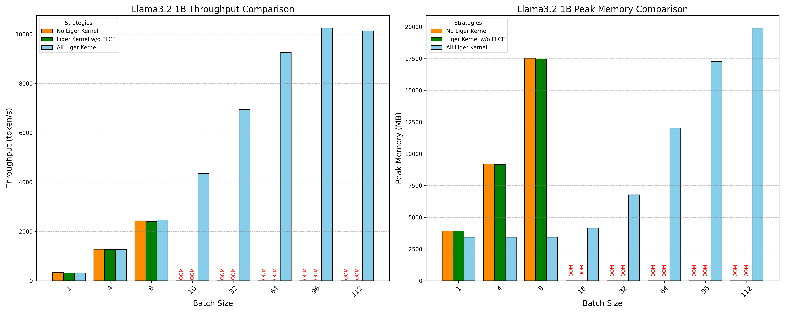
    - **Figure 16: Ablation Study on Fused Linear Cross Entropy with Fixed Sequence Length.**

- **Comparison of Throughput and Peak Memory Usage with a Fixed Batch Size:**

    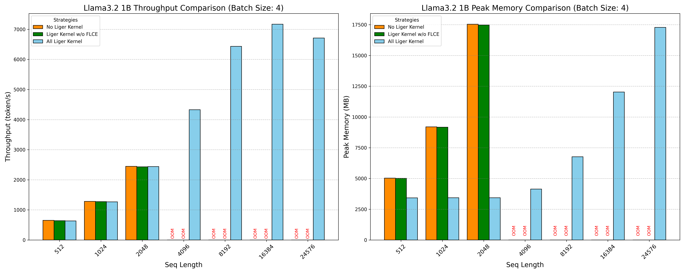
    - **Figure 17: Ablation Study on Fused Linear Cross Entropy with Fixed Batch Size.**

    From the results, we can confirm that nearly 100% of the memory reduction and throughput improvement is caused by Fused Linear Cross Entropy. The other fused kernels do not have a significant impact on memory usage and throughput. Therefore, Fused Linear Cross Entropy is the most crucial component of the Liger Kernel.

# Conclusion

- **The main problem of the current LLM training**

    The primary challenge in training Large Language Models (LLMs) today is the significant peak memory consumption associated with the cross-entropy loss computation. This memory bottleneck restricts the scalability of training by limiting the permissible batch size and sequence length. As models grow in size and complexity, the demand for memory-efficient training techniques becomes increasingly critical to enable the training of larger and more capable models without incurring prohibitive computational costs or requiring excessively large hardware resources.

- **The main contribution of the Liger kernel**

    The Liger Kernel addresses this critical memory bottleneck through two key innovations:
    
    1. **Fused Kernel Operations:** By combining multiple operations into a single kernel, the Liger Kernel reduces the overhead associated with kernel launches, memory transfers, and dispatching. This fusion not only optimizes the execution speed but also minimizes the peak memory usage by eliminating intermediate storage of activation tensors. Specifically, the Fused Linear Cross Entropy kernel integrates the cross-entropy loss calculation and gradient computation into one streamlined process, significantly lowering memory overhead.
    
    2. **Chunking Strategy:** The Liger Kernel employs a chunking mechanism to divide the cross-entropy calculation into smaller, manageable segments. This approach ensures that the peak memory usage is proportional to the chunk size rather than the entire batch size or sequence length. By dynamically adjusting the chunk size based on the model's hidden size and vocabulary size, the Liger Kernel maintains a stable memory footprint even as the batch size and sequence length scale up. This chunking strategy effectively decouples memory usage from model scaling, enabling more flexible and efficient training of large-scale language models.

In summary, the Liger Kernel provides a robust solution to the memory challenges in LLM training by optimizing kernel operations and employing intelligent memory management techniques. 

# Personal Reflection

- **How to train the large language model efficiently in 2024**

    There are many memory-efficient training techniques for training large language models nowadays, thanks to the Huggingface Transformers library developers and the open-source community. These techniques (including the Liger kernel) are all integrated into the Huggingface Transformers library, making them easy to use and deploy. The following is my recommended approach to efficiently train a large language model with full parameter training (not considering LoRA) in 2024:

    - *Essential settings to enable no matter what:*
        1. Enable Liger kernel
        2. (If multiple GPUs) Enable Stage 2 ZeRO
        3. Enable gradient checkpointing (slightly increases computation overhead)

    - *If still facing Out of Memory issues:*

        4. Enable mixed precision training (slightly reduces precision)
        5. (If multiple GPUs) Enable Stage 3 ZeRO (with additional communication overhead)
        6. Enable DeepSpeed CPU offloading (increases PCIe transfer overhead)
        7. Enable GaLore (reduces precision)
        8. Enable 8-bit optimizer (reduces precision)
        9. Enable DeepSpeed NVMe offloading (significantly increases PCIe transfer overhead)

    - *If have desired batch size:*
        1. Adjust to an appropriate batch size (to avoid OOM errors and fully utilize the GPU).
        2. Use gradient accumulation to achieve the desired effective batch size (e.g., accumulate 4 batches of 32 to reach an effective batch size of 128).

# Reference

1. Attention Is All You Need, https://doi.org/10.48550/arXiv.1706.03762.
2. Improving Language Understanding by Generative Pre-Training, https://cdn.openai.com/research-covers/language-unsupervised/language_understanding_paper.pdf
3. Language Models are Unsupervised Multitask Learners, https://cdn.openai.com/better-language-models/language_models_are_unsupervised_multitask_learners.pdf
4. Language Models are Few-Shot Learners, https://arxiv.org/abs/2005.14165
5. Converting GPT to Llama2, https://github.com/rasbt/LLMs-from-scratch/blob/main/ch05/07_gpt_to_llama/converting-gpt-to-llama2.ipynb
6. RoFormer: Enhanced Transformer with Rotary Position Embedding, https://arxiv.org/abs/2104.09864
7. Root Mean Square Layer Normalization, https://arxiv.org/abs/1910.07467
8. GLU Variants Improve Transformer, https://arxiv.org/abs/2002.05202
9. GQA: Training Generalized Multi-Query Transformer Models from Multi-Head Checkpoints, https://arxiv.org/abs/2305.13245
10. Harmony: Overcoming the Hurdles of GPU Memory Capacity to Train Massive DNN Models on Commodity Servers, https://arxiv.org/abs/2202.01306
11. Adam: A Method for Stochastic Optimization, https://arxiv.org/abs/1412.6980
12. Decoupled Weight Decay Regularization, https://arxiv.org/abs/1711.05101
13. ZeRO: Memory Optimizations Toward Training Trillion Parameter Models, https://arxiv.org/abs/1910.02054
14. DeepSpeed, https://github.com/microsoft/DeepSpeed
15. PyTorch FSDP: Experiences on Scaling Fully Sharded Data Parallel, https://arxiv.org/abs/2304.11277
16. ZeRO-Offload: Democratizing Billion-Scale Model Training, https://arxiv.org/abs/2101.06840
17. ZeRO-Infinity: Breaking the GPU Memory Wall for Extreme Scale Deep Learning, https://arxiv.org/abs/2104.07857
18. Mixed-Precision Training of Deep Neural Networks, https://developer.nvidia.com/blog/mixed-precision-training-deep-neural-networks/
19. 8-bit Optimizers via Block-wise Quantization, https://arxiv.org/abs/2110.02861
20. GaLore: Memory-Efficient LLM Training by Gradient Low-Rank Projection, https://arxiv.org/abs/2403.03507
21. LoRA: Low-Rank Adaptation of Large Language Models, https://arxiv.org/abs/2106.09685
22. QLoRA: Efficient Finetuning of Quantized LLMs, https://arxiv.org/abs/2305.14314
23. gradient-checkpointing, https://github.com/cybertronai/gradient-checkpointing
24. Accelerating PyTorch with CUDA Graphs, https://pytorch.org/blog/accelerating-pytorch-with-cuda-graphs/
25. Optimizing Production PyTorch Models’ Performance with Graph Transformations, https://pytorch.org/blog/optimizing-production-pytorch-performance-with-graph-transformations/
26. Understanding the Visualization of Overhead and Latency in NVIDIA Nsight Systems, https://developer.nvidia.com/blog/understanding-the-visualization-of-overhead-and-latency-in-nsight-systems/
27. Introducing Triton: Open-source GPU programming for neural networks, https://openai.com/index/triton/
28. FlashAttention: Fast and Memory-Efficient Exact Attention with IO-Awareness, https://arxiv.org/abs/2205.14135
29. Unsloth, https://unsloth.ai/
30. Layer Normalization, https://arxiv.org/abs/1607.06450
31. Liger Kernel: Efficient Triton Kernels for LLM Training, https://arxiv.org/abs/2410.10989
32. GPU MODE Lecture 28: Liger Kernel - Efficient Triton Kernels for LLM Training, https://www.youtube.com/watch?v=gWble4FreV4
33. PyTorch Profiler With TensorBoard, https://pytorch.org/tutorials/intermediate/tensorboard_profiler_tutorial.html